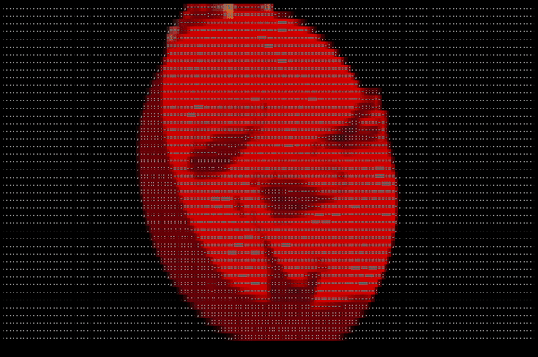

# GifTerm

GIFs on the terminal



*The terminal output is actual text*

## Contents

- [Installation](#installation)
- [Usage](#usage)
- [Video to Gif](#how-to-convert-a-video-into-a-gif)

## Installation

Clone the repository 

```
$ git clone https://github.com/namzug16/gifterm.git
```

```
$ cd gifterm
```

And then you can simply install it by running

```
$ make
```

Just make sure to have installed and setup the minimum required version of Go. You can find it in the go.mod file 

## Usage

### Basic usage

```
$ gifterm <input.gif>
```

### Flags

- **cd**: Character Density. Default ".,:-=i|%O#@$X"
- **fps**: FPS. Default 12
- **randomBlank**: Set if a random character from CD should be picked for a blank pixel
- **ofg**: Only Foreground. Set if only the foreground color should be set

#### Examples
```
$ gifterm -cd ".,:-=i|%O#@$X" -fps 12 -randomBlank <input.gif> 
```


```
$ gifterm -fps 16 -ofg <input.gif> 
```


## How to convert a video into a GIF

> Keep in mind that long GIFs will take more time to process

Make sure to have installed ffmpeg and imagemagick and then run

```
$ ffmpeg -i <input.mp4> -vf "fps=12" -c:v pam -f image2pipe - | convert - input.gif
```
